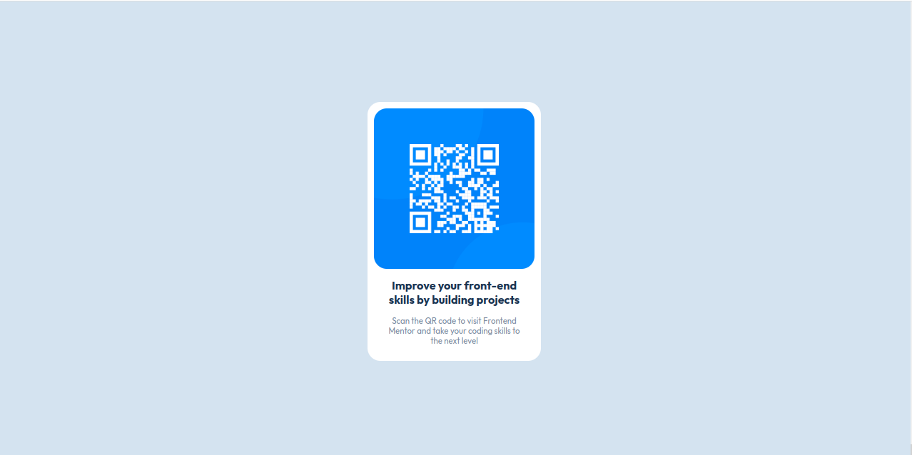
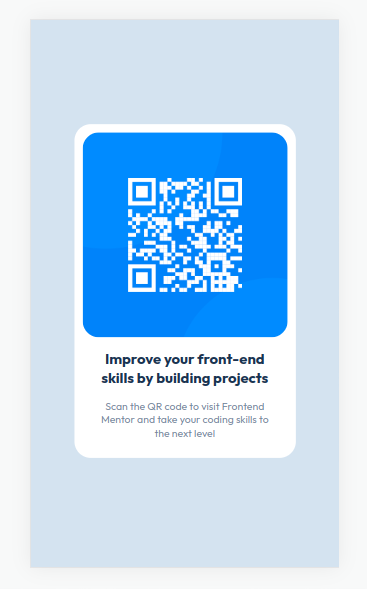

# QR-CODE

# Frontend Mentor - QR code component solution

This is a solution to the [QR code component challenge on Frontend Mentor](https://www.frontendmentor.io/challenges/qr-code-component-iux_sIO_H). Frontend Mentor challenges help you improve your coding skills by building realistic projects.
 

## Table of contents

- [Overview](#overview)
  - [Screenshot](#screenshot)
  - [Links](#links)
- [My process](#my-process)
  - [Built with](#built-with)
  - [What I learned](#what-i-learned)
  - [Continued development](#continued-development)
  - [Useful resources](#useful-resources)
- [Author](#author)
- [Acknowledgments](#acknowledgments)


## Overview

### Screenshot





### Links

- Solution URL: [Solution/GitHub Repo](https://github.com/ernest-ayitey/QR-CODE)
- Live Site URL: [QR_CODE Live](https://qr-code-omega-rose.vercel.app/)


## My process

### Built with

- Semantic HTML5 markup
- CSS custom properties
- Flexbox


```html
<h1>Some HTML code I'm proud of</h1>
```
```css
:root {
      --white-color: hsl(0, 0%, 100%);
      --light-gray: hsl(212, 45%, 89%);
      --dark-gray: hsl(218, 44%, 22%);
      --grayish-blue: hsl(220, 15%, 55%);
      --font-family: 'Outfit', sans-serif;
    }

 .col1 {
      display: flex;
      align-items: center;
      justify-content: center;
    }
```
### Continued development

<h2>Areas i want to focus on</h2>

<p> layouts</p>

## Author

- Frontend Mentor - [@ernest-ayitey](https://www.frontendmentor.io/profile/yourusername)


## License

This project is [MIT](https://github.com/ernest-ayitey/QR-CODE/blob/main/LICENSE) licensed
